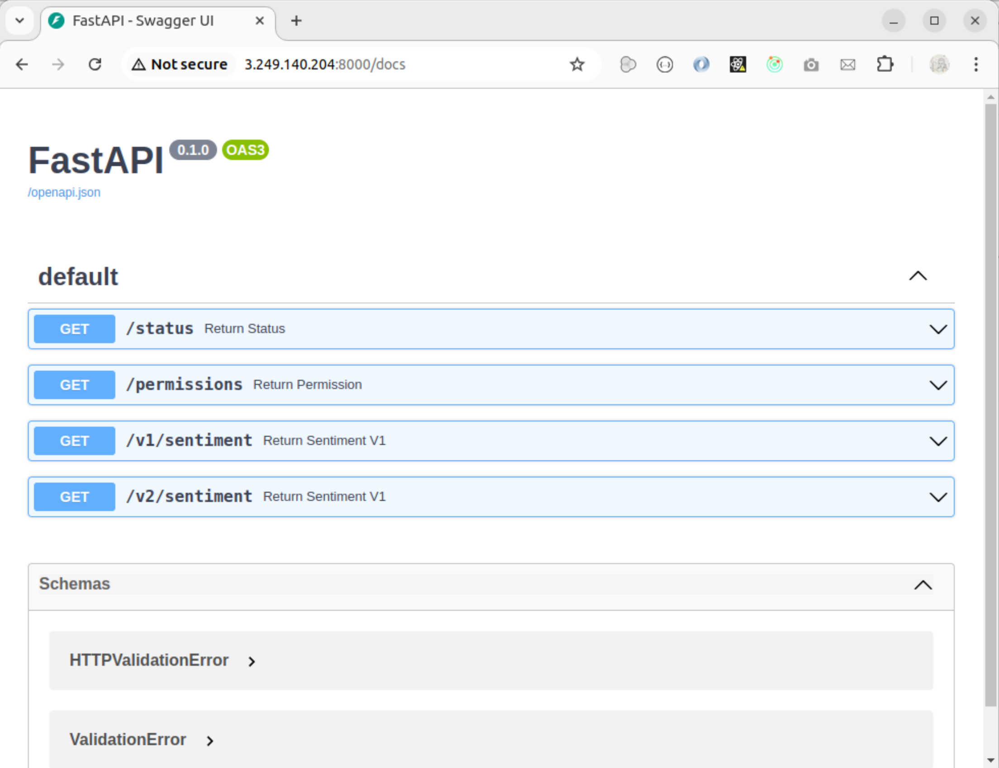

# Développement des tests en utilisant Docker :

Voici les points d’entrée de notre API :

- /status  ==> renvoie 1 si l'API fonctionne
- /permissions ==> renvoie les permissions d'un utilisateur
- /v1/sentiment ==> renvoie l'analyse de sentiment en utilisant un vieux modèle
- /v2/sentiment ==> renvoie l'analyse de sentiment en utilisant un nouveau modèle

Pour garder les pipelines de test modulaires et flexibles, nous créons un conteneur par test. Cette approche permet d’isoler chaque composant, ce qui facilite le débogage et réduit le risque que des changements dans une partie du code n'affectent tout le pipeline. Ça permet aussi de paralléliser les tests, ce qui accélère l'exécution globale.

Pour pouvoir joindre le conteneur ‘fast_api’, nous devons le mettre dans le même réseau que le conteneur que nous allons développer. Nous commençons par créer un nouveau réseau avec la commande suivante : 

```#Bash
docker network create --name api_network
```
Lancer le conteneur datascientest/fastapi:1.0.0 en l’attachant au réseau ‘api_network’ 

```#Bash
docker container run -p 8000:8000 --name fast_api --network api_network datascientest/fastapi:1.0.0
```

Pour vérifier que le conteneur est bien lancé, nous pouvons afficher tous les conteneurs qui sont en cours d'exécution et sélectionner celui qui nous intéresse avec la commande grep :

```#Bash
docker container ls -a  | grep fast_api
```

Pour lancer l’api sur le browser, nous devons tapper l’url :

```#Bash 
http://<IP-Of-The-Host-On-Which-The-Container-Run>:8000
```
Pour afficher tous les endpoints de l’api :

```#Bash 
http://<IP-Of-The-Host-On-Which-The-Container-Run>:8000/docs
```

Voici ce qui s’affiche sur le navigateur :

<p align="center">

</p>
<p align="center" style="font-weight: bold;">
Figure 1: Liste des API exposées
</p>

1. Le test du end-point Permissions

Nous créons un client Java 'PermissionsTest.java' qui permet de se connecter à l'API que nous souhaitons tester. Le client Java a pour objectif de :
  - Envoyer une requête de type GET à l'API
  - Recevoir la réponse 
  - Sauvegarder la réponse dans un fichier de logs dans notre conteneur _'/app/logs/api_test.log'_

Le lancement du client Java permet de tester l'API, mais nous n'aurons pas accès aux logs si nous arrêtons le conteneur.
Voici le code source de la classe Java 'PermissionsTest' :
import java.io.BufferedReader;
import java.io.InputStreamReader;
import java.io.FileWriter;
import java.io.IOException;
import java.net.HttpURLConnection;
import java.net.URL;

public class PermissionsTest {
    public static void main(String[] args) {
        try {
            String apiAddress = System.getenv("API_ADDRESS");
            String apiPort = System.getenv("API_PORT");

            String apiUrl = "http://" + apiAddress + ":" + apiPort + "/permissions?username=alice&password=wonderland";
            System.out.println("The URL: " + apiUrl);

            URL url = new URL(apiUrl);
            HttpURLConnection connection = (HttpURLConnection) url.openConnection();
            connection.setRequestMethod("GET");

            int responseCode = connection.getResponseCode();
            System.out.println("Response Code: " + responseCode);

            BufferedReader in = new BufferedReader(new InputStreamReader(connection.getInputStream()));
            StringBuilder response = new StringBuilder();
            String inputLine;
            while ((inputLine = in.readLine()) != null) {
                response.append(inputLine);
            }
            in.close();

            String output = "\n============================\n" +
                            "    Authentication Test\n" +
                            "============================\n" +
                            "Request done at \"/permissions\"\n" +
                            "| username=\"alice\"\n" +
                            "| password=\"wonderland\"\n\n" +
                            "Expected result = 200\n" +
                            "Actual result = " + responseCode + "\n" +
                            "Response body = " + response.toString() + "\n\n" +
                            "==> " + (responseCode == 200 ? "SUCCESS" : "FAILURE") + "\n";

            System.out.println(output);

            String logEnv = System.getenv("LOG");
            if ("1".equals(logEnv)) {
                writeLog(output);  // Écrire dans le fichier si LOG=1
            }

        } catch (Exception e) {
            e.printStackTrace();
        }
    }

    private static void writeLog(String output) {
        try {
            FileWriter writer = new FileWriter("/app/logs/api_test.log", true);  // 'true' pour ajouter au fichier existant
            writer.write(output);
            writer.close();
            System.out.println("Log saved to /app/logs/api_test.log");
        } catch (IOException e) {
            System.err.println("Error writing log file: " + e.getMessage());
        }
    }
}

Pour pouvoir accéder aux fichiers de logs même après avoir arrêté le conteneur, nous devons définir un volume qui assure la liaison entre l'emplacement que nous définissons sur la machine hôte et l'emplacement dans lequel nous sauvegardons les fichiers de logs dans le conteneur. Nous pouvons réaliser cette liaison en exécutant la commande docker run comme nous allons l’indiqué ci-dessous.


Le code source du Dockerfile : 

# Utilise l'image officielle de Java 
FROM eclipse-temurin:17-jdk-alpine

# Créer le répertoire app et le définir comme répertoire de travail 
WORKDIR /app

# Copier le fichier Java dans le répertoire app
COPY PermissionsTest.java .

# Compiler le code Java
RUN javac PermissionsTest.java

# Crée le dossier logs dans /app
RUN mkdir -p /app/logs

# Run the Java program
CMD ["java", "PermissionsTest"]


Pour construire le conteneur : 

docker build -t auth-test .


Lancer le conteneur :

docker run --rm -e API_ADDRESS="fast_api" -e API_PORT="8000" -e LOG=1 --network api_network -v $(pwd)/logs:/app/logs java-api-test


 
Nous verifions que le fichier ‘api_test.log’ a bien été généré et qu’il est présent dans notre répertoire sur la machine hôte, puis nous affichons son contenu :

  
2. Le test du endpoint d’authorisation
Pour tester ce deuxième point d’entrée, qui est présent en deux versions, v1 et v2, nous suivons la même logique que le test ‘Permissions’, sauf que cette fois-ci, nous implémentons le test en Python.
Nous précisons que certains utilisateurs ont le droit d’utiliser uniquement la première ou la deuxième version, tandis que d’autres peuvent utiliser les deux versions.
L’API d’autorisation accepte une requête GET avec deux paramètres : username et password, et retourne une réponse appropriée.
Voici un exemple d’une URL qui invoque la version 2 de l’API distante ‘fast_api’: 

http://3.249.140.204:8000/v2/sentiment?username=alice&password=wonderland

Et la réponse retournée est la suivante :
{
  "username": "alice",
  "version": "v2",
  "sentence": "hello world",
  "score": 0
}

Cette réponse contient toujours la même phrase et le même score nul, retournés par défaut.
Le résultat obtenu est enregistré dans le fichier de log api_test.log, à l'intérieur du conteneur Docker de test.

Le code en Python pour tester l’API d’autorisation : 
import os
import sys
import requests

# Récupération des paramètres depuis les arguments
try:
    username = sys.argv[1]
    password = sys.argv[2]
except IndexError:
    print("Usage: python script.py <username> <password>")
    sys.exit(1)

# Définition de l'adresse de l'API
api_address = os.environ.get('API_ADDRESS', '')
api_port = os.environ.get('API_PORT', 8000)
api_path = os.environ.get('API_PATH', 'v1/sentiment')
# Requête
response = requests.get(
    url=f'http://{api_address}:{api_port}/{api_path}',
    params={
        'username': username,
        'password': password,
    }
)

output=""
# Affichage de la réponse
if response.status_code == 200:
    try:
        result = response.json()  # Extraction correcte des données JSON

        output = f'''
        ============================
                Sentiment Analysis
        ============================

        Username: {result.get("username")}
        Password:  {result.get("password")}
        Sentence: "{result.get("sentence")}"
        Score:    {result.get("score")}

        '''
        print(output)
    except Exception as e:
        print(f"Error while processing the response JSON: {e}")

else:
    output = f"Error: API call failed with status code {response.status_code}\n"
    print(output)

# Enregistrement dans les logs si nécessaire
if os.environ.get('LOG') == '1':
    with open('/app/logs/api_test.log', 'a') as file:
        file.write(output)

le code source du Dockerfile : 

# Dockerfile pour lancer le test Python d'API
FROM python:3.11-alpine

# Définir le répertoire de travail
WORKDIR /app

# Copier le fichier AuthorizationTest
COPY AuthorizationTest.py .

# Installer les dépendances nécessaires
RUN pip install --no-cache-dir requests

# Exécuter le script Python avec les paramètres fournis
ENTRYPOINT ["python", "AuthorizationTest.py"]

Cependant, pour éviter la perte de ce fichier à chaque arrêt du conteneur, il est nécessaire de créer un volume ou un montage de répertoire entre la machine hôte et le conteneur de test.
Cela peut être réalisé en utilisant l'option -v dans la commande docker run.
Pour construire l’image :

docker build -t python-api-auth-test .
 
Pour exécuter l’image :
docker run --rm \
    -e API_ADDRESS="fast_api" \
    -e API_PORT="8000" \
    -e API_PATH="v1/sentiment" \
    -e LOG=1 \
    --network api_network \
    -v $(pwd)/logs:/app/logs \
    python-api-auth-test \
    alice wonderland

3. Le test du endpoint de contenu
L’API, dans ce cas, accepte une requête GET avec trois paramètres : username, password et la phrase à évaluer.
Elle retourne une réponse au format JSON contenant, en plus des paramètres passés en entrée, un score indiquant si la phrase exprime une émotion triste, neutre ou joyeuse.

Voici le code en python du test de contenu :

import os
import sys
import requests

# Récupération des paramètres depuis les arguments
try:
    username = sys.argv[1]
    password = sys.argv[2]
    sentence = sys.argv[3]
except IndexError:
    print("Usage: python script.py <username> <password> <sentence>")
    sys.exit(1)

# Définition de l'adresse de l'API
api_address = os.environ.get('API_ADDRESS', '')
api_port = os.environ.get('API_PORT', 8000)
# Récupération du chemin d'endpoint depuis une variable d'environnement 
api_path = os.environ.get('API_PATH', 'v1/sentiment')

# Requête
r = requests.get(
    url=f'http://{api_address}:{api_port}/{api_path}',
    params={
        'username': username,
        'password': password,
        'sentence': sentence
    }
)

output = f'''
============================
    Sentiment Analysis Test
============================

Request to "/v1/sentiment"
| username="{username}"
| password="{password}"
| sentence="{sentence}"

Expected result = 200
Actual result = {r.status_code}

==>  {"SUCCESS" if r.status_code == 200 else "FAILURE"}

'''

print(output)

# Enregistrement des résultats si LOG=1
if os.environ.get('LOG') == '1':
    with open('/app/logs/api_test.log', 'a') as file:
        file.write(output)

le code source du Dockerfile : 

# Dockerfile pour lancer le test Python d'API
FROM python:3.11-alpine

# Définir le répertoire de travail
WORKDIR /app

# Copier le fichier AuthorizationTest
COPY ContentTest.py .

# Installer les dépendances nécessaires
RUN pip install --no-cache-dir requests

# Exécuter le script Python avec les paramètres fournis
ENTRYPOINT ["python", "ContentTest.py"]

Pour build l’image :

docker build -t python-api-content-test .
 
Pour exécuter l’image :
docker run --rm \
    -e API_ADDRESS="fast_api" \
    -e API_PORT="8000" \
    -e API_PATH="v1/sentiment" \
    -e LOG=1 \
    --network api_network \
    -v $(pwd)/logs:/app/logs \
    python-api-content-test \
    alice wonderland "I am not happy"


4. l’automatisation de création des conteneurs
Pour automatiser la création de tous les conteneurs, nous pouvons utiliser docker-compose, qui définit chaque conteneur comme un service.
Pour passer les paramètres de manière dynamique, nous pouvons les déclarer dans un fichier .env placé au même niveau que le fichier docker-compose.
Le fichier docker-compose pourrait s'écrire de la façon suivante :

version: '3.8'

services:
  api-service:
    image: datascientest/fastapi:1.0.0
    environment:
      - API_ADDRESS=api-service
      - API_PORT=8000
      - LOG=1
    networks:
      - api_network
    volumes:
      - ./logs:/app/logs
    ports:
      - "8000:8000"

  java-test:
    build:
      context: ./test1
      dockerfile: Dockerfile
    environment:
      - API_ADDRESS=api-service
      - API_PORT=8000
      - LOG=1
    networks:
      - api_network
    volumes:
      - ./logs:/app/logs
    depends_on:
      - api-service

  python-auth-test:
    build:
      context: ./test2
      dockerfile: Dockerfile
    environment:
      - API_ADDRESS=api-service
      - API_PORT=8000
      - API_PATH=${API_PATH}
      - LOG=1
    networks:
      - api_network
    volumes:
      - ./logs:/app/logs
    command: ["${USERNAME}", "${PASSWORD}"]
    depends_on:
      - api-service

  python-content-test:
    build:
      context: ./test3
      dockerfile: Dockerfile
    environment:
      - API_ADDRESS=api-service
      - API_PORT=8000
      - API_PATH=${API_PATH}
      - LOG=1
    networks:
      - api_network
    volumes:
      - ./logs:/app/logs
    command: ["${USERNAME}", "${PASSWORD}", "${SENTENCE}"]
    depends_on:
      - api-service

networks:
  api_network:
    driver: bridge


Le fichier .env: 


API_PATH=v1/sentiment 
USERNAME=alice 
PASSWORD=wonderland 
SENTENCE="I am not happy"

La commande pour lancer les services définis par le docker-compose est : 

docker-compose up --build
 
L'exécution de la commande permet à Docker de charger automatiquement les variables d'environnement définies dans le fichier .env et de les injecter dans les services correspondants.
L'inconvénient de cette solution est qu'elle n'est pas entièrement automatisée, car pour tester une autre version, il faut modifier le contenu du fichier .env pour définir de nouvelles variables d'environnement qui sont lues par le fichier docker-compose. Nous proposons une automatisation complète en créant un fichier bash.
4. L’automatisation de création des conteneurs et d’automatisation des tests :
Pour couvrir tous les cas de test possibles en lançant les conteneurs de façon automatique, nous avons défini un script bash qui modifie les paramètres d'entrée de manière itérative pour chaque test, comme suit :

#!/bin/bash
configurations=(
  "API_PATH=v1/sentiment USERNAME=alice PASSWORD=wonderland SENTENCE='I am not happy'"
  "API_PATH=v2/sentiment USERNAME=alice PASSWORD=wonderland SENTENCE='I am not happy'"
)

for config in "${configurations[@]}"; do
  export $config
  docker-compose up --build --force-recreate -d
  sleep 10  # Attendre que les tests s'exécutent
  docker-compose down
done
